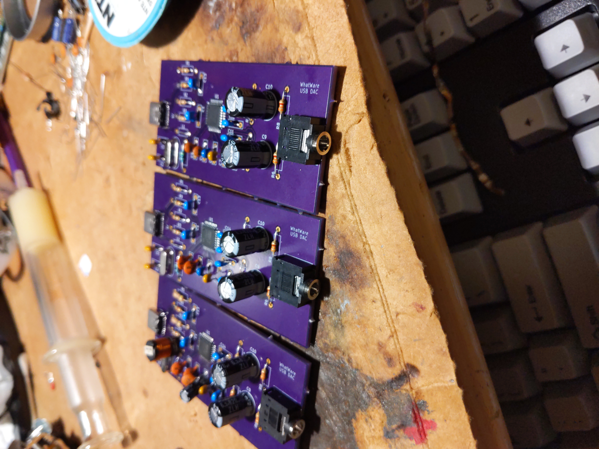

# usb-dac

USB DAC based on TI PCM2912A IC
This design is tested and working, I use it as my daily driver DAC

## pcb fabrication
i ordered my pcbs from OSHpark, the project link is here for a 1-click order that is already configured and will work well https://oshpark.com/shared_projects/iy0FjLmS

## performance tweaking
this DAC has been designed with good low-frequency response in mind, large output capacitors are used to ensure very low frequencies can be reproduced

to adjust high-frequency response  C4 and C5 can be decreased to allow higher-frequency sounds to make it to the output. Too low of a value for either of these will lead to a muffled sound

C9 and C10 are the output capacitors, the Rubycon model listed in the BOM does very well for the price but they can be swapped out for any higher quality electrolytic capacitor with the same lead spacing. to increase LF response make these a larger value, to decrease make them a smaller value. i just used these as i had like 70 of them spare from another project

## assembly
check the assembly directory for assembly pictures
this board design is tested and working, but if you would like any help you can open a github issue and i'll try my best (no i will most likely not give you one for free, sorry)
During assembly it is very helpful to open the board view in KiCad to see the component values and the BOM
This board has been designed with easy assembly in mind, there are only 2 SMD parts which you could get assembled for you at a PCB assembly service, the rest of the parts are through-hole and very easy to solder DIY.

## parts
The parts in the BOM can all be purchased at Mouser electronics (DigiKey probably has them too, i didn't check)
I just went with the cheapest option of the rated component value with a minimum voltage rating of 5v, so if you need to get components from some other supplier you can do that as well and it will probably work, just make sure to double-check the lead spacing for the capacitors and inductors and stuff
